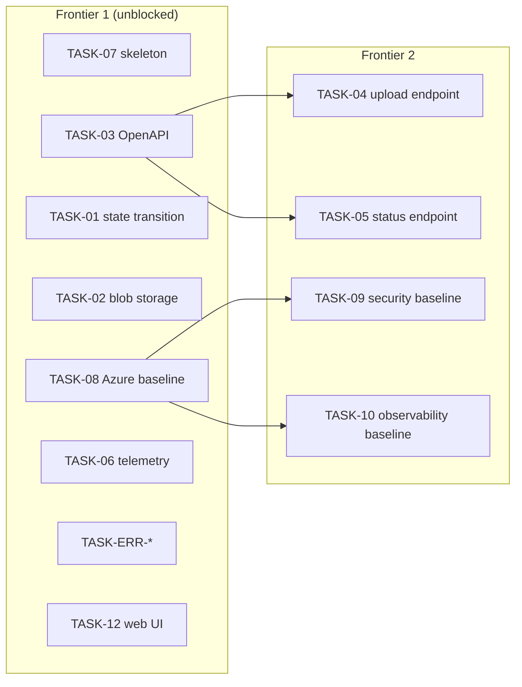

# CED Adhesion pilot — implementation plan

> Status: **planning**. Decisions marked *locked* were confirmed by a human on
> 2026-09-21. This plan is the execution projection of the ticket set in
> `pagopa/dx` PR [#2185](https://github.com/pagopa/dx/pull/2185), branch
> `chores/dr-skill-evak`, folder `demo/outcome/`.

## 1. Sources and traceability

| Source | Location | Role |
| --- | --- | --- |
| Design Review / SRS | `demo/outcome/design-review.md` | Operational source of truth (`CED-ADHESION`), `metadata.status: draft` |
| PRD | `demo/prd.md` | Outcome, JTBD-01, KPI >80%, guardrail (no PII in logs) |
| Use Case | `demo/outcome/use-cases/uc-01-upload-signed-agreement.md` | `UC-01`, **confirmed `ready`**; `AC-01..03`; typed errors |
| API contract | `demo/outcome/openapi.yaml` | `contracts.item-001`, draft 0.1.0 |
| Backlog projection | `demo/outcome/tickets.md` | Epics, Stories, Tasks, Spikes and blocking edges |

Target repository: **`pagopa/aiepdf-poc`** (this repo), already bootstrapped as an
Nx + pnpm monorepo with `infra/bootstrapper/dev` and `infra/repository` applied;
`apps/`, `packages/` and `infra/resources/` do not exist yet.

Azure context (inferred from `infra/bootstrapper/dev`): subscription
`35e6e3b2-4388-470e-a1b9-ad3bc34326d1`, `italynorth`, naming
`prefix=dx, env_short=d, domain=aiepdf, instance_number=01`, app name `adhesion`,
tags `BusinessUnit=dx / CostCenter=TS000 / ManagementTeam=dx`.

## 2. Locked decisions (spike outcomes)

| Spike | Open item | Decision |
| --- | --- | --- |
| `SPIKE-REPO` | `open.item-005` | `pagopa/aiepdf-poc`, Nx monorepo, `apps/` + `packages/` |
| `SPIKE-TEMPLATE` | `open.item-001` | Not frozen → App Configuration key/feature flag; no version enforcement |
| `SPIKE-FORMAT` | `open.item-002` | CAdES only, `.p7m` / `application/pkcs7-mime` |
| `SPIKE-LIB` | `open.item-006` | `SignatureVerifier` port + in-process JS adapter, swappable |
| `SPIKE-AUTH` | `open.item-004` | No auth in the pilot; OpenAPI `security: []` |
| `SPIKE-CLASSIFICATION` | `open.item-007` | Confidential; retention TBD; no auto-deletion in pilot |
| `SPIKE-SIZE` | `open.item-010` | 10 MB |
| `uc-open-01` | — | Repeated step-1 upload → `409 PRACTICE_STATE_INVALID` |

Additional human decisions: **UI in pilot scope**; UI hosting via **Azure Static
Web Apps** (DX pipeline `release-azure-staticapp-v1.yaml`); **no APIM** in the
pilot; persistence **PostgreSQL Flexible Server**; Azure App Configuration used
for **both settings and feature flags**; UI component system
**`@pagopa/mui-italia`**.

Corollary: because the UI is a Static Web App (not inside the Container App
Environment), the API is reached from the browser, so it must be **publicly
exposed with CORS** for the SWA origin.

## 3. Frontier

- **F1**: `TASK-01`, `TASK-02`, `TASK-03`, `TASK-06`, `TASK-07`, `TASK-08`,
  `TASK-ERR-EXT/SIG/STATE/SIZE`, `TASK-12` (new), and the acceptance checks of
  `STORY-01`/`STORY-02`.
- **F2**: `TASK-04`, `TASK-05` (need `TASK-03`); `TASK-09`, `TASK-10` (need `TASK-08`).
- Non-blocking: `TASK-11` runbook (sequenced after the topology settles).

## 4. Frontier-1 implementation plan

### 4.1 Repository skeleton — `TASK-07`

| Workspace | Content |
| --- | --- |
| `apps/adhesion-api` | HTTP layer, DI, config bootstrap, Dockerfile, Nx targets |
| `apps/adhesion-web` | Next.js 14 (static export), `@pagopa/mui-italia` theme, React 18 |
| `packages/adhesion-domain` | Practice/Document entities, states, invariants, typed errors |
| `packages/adhesion-verification` | `SignatureVerifier` port + CAdES `.p7m` adapter |
| `packages/adhesion-contracts` | `openapi.yaml` + generated types, contract lint/verify |

Clean Architecture (radar: trial) layers inside `apps/adhesion-api`:
`domain → application → infrastructure → http`. Test tooling Vitest (adopt).

### 4.2 IaC — `TASK-08`, plus `TASK-09`/`TASK-10` later

Flat layout `infra/resources/dev/` (single region; supported by the DX reusable
workflows). DX registry modules only:

| Module | Version | Purpose |
| --- | --- | --- |
| `pagopa-dx/azure-core-values-exporter/azurerm` | `~> 2.0` | Reuse `common_vnet`, `common_pep_snet`, `common_key_vault`, `application_insights`, `common_log_analytics_workspace`, `common_resource_group_name` |
| `pagopa-dx/azure-container-app-environment/azurerm` | `~> 4.0` | Container Apps environment + subnet via `dx_available_subnet_cidr` |
| `pagopa-dx/azure-container-app/azurerm` | `~> 7.0` | `adhesion-api` container, managed identity, ingress, App Configuration endpoint, health probes |
| `pagopa-dx/azure-storage-account/azurerm` | `~> 4.0` | Private container for agreement blobs |
| `pagopa-dx/azure-postgres-server/azurerm` | `~> 5.0` | Practice/Document persistence |
| `pagopa-dx/azure-app-configuration/azurerm` | `~> 2.0` | Settings + feature flags, Key Vault integration |
| `pagopa-dx/azure-role-assignments/azurerm` | `~> 4.0` | RBAC for the container app identity |

Reuse the shared core Key Vault (no new Key Vault). Backend state key
`dx/aiepdf/resources/dev.tfstate` in the DX state account. `@pagopa/mui-italia`
is `assess`/not-on-radar and Azure App Configuration is `assess` on the radar:
both are human-approved exceptions.

Azure Static Web App (UI hosting) uses `azurerm_static_web_app` directly (no DX
module exists), mirroring DX `infra/resources/_modules/dx_website`; the deploy
identity needs the `PagoPA Static Web Apps List Secrets` custom role.

### 4.3 App Configuration

Keys/flags seeded from a JSON file in the repo, imported with
`az appconfig kv import` (DX `appsettings-deploy` pattern):

- `adhesion:upload:maxSizeMb` = `10`
- `adhesion:signature:allowedFormats` = `CAdES`
- `adhesion:agreement:templateVersion` (placeholder)
- feature flags: `adhesion.upload.enabled`, `adhesion.verification.strict`
- secrets remain Key Vault references, resolved through App Configuration.

### 4.4 Domain, persistence, storage — `TASK-01`, `TASK-02`

- Practice aggregate with `REQUEST → PENDING`, `Document(signingStep)`,
  ≤1 valid document per signing step, atomic transition.
- Author `contracts.item-002` (Practice/Document data model) with migrations.
- `AgreementStorage` adapter on the storage account via Managed Identity; no
  public access; encrypted in transit and at rest; no PII in metadata or logs.

### 4.5 Contract — `TASK-03`

Apply locked decisions to `openapi.yaml` (`security: []`, 10 MB bound, CAdES
`.p7m`, error enum), place it in `packages/adhesion-contracts`, wire
validation, generate types, lint/verify with Optic (radar: trial).

### 4.6 Telemetry — `TASK-06`

`@pagopa/azure-tracing` + Application Insights (connection from the core Key
Vault), structured logs without PII, metrics/traces for the upload flow, alert
on 5xx upload rate (NFR-07).

### 4.7 Typed errors — `TASK-ERR-EXT/SIG/STATE/SIZE`

One catalog in `adhesion-domain`; identifiers exactly
`AGREEMENT_EXTENSION_INVALID`, `AGREEMENT_SIGNATURE_INVALID`,
`PRACTICE_STATE_INVALID`, `AGREEMENT_FILE_TOO_LARGE`; mapped to RFC 9457
`application/problem+json` with no PII in `detail`.

### 4.8 Web UI — `TASK-12` (new)

Next.js 14 + React 18 + MUI v5 + `@pagopa/mui-italia`, static export (`out`),
upload form and status confirmation per `UC-01`, client-side calls to the public
API. Built solely from the contract; no Figma/blueprint exists
(`open.item-012`) — accessibility and UX remain auditable gaps.

### 4.9 CI

- `.github/workflows/_release-terraform-apply-dev-resources.yaml` wrapping
  `pagopa/dx/.github/workflows/infra_plan.yaml@main` + `infra_apply.yaml@main`
  (`environment: dev`, `base_path: infra/resources`, private agent + labels),
  mirroring the working bootstrapper workflow.
- Container App release via `release-azure-containerapp-v1.yaml@main`.
- Static Web App release via `release-azure-staticapp-v1.yaml@main`
  (`workspace_name: adhesion-web`, `output_dir: out`).

## 5. Ticket deltas vs the source projection

- **Add `TASK-12`** — Upload Web UI (EPIC-01), since UI is now in pilot scope.
- **Extend `TASK-08`** with the Static Web App resource, the App Configuration
  instance, and the SWA deploy role.
- **Amend `TASK-08`** to reuse the shared core Key Vault instead of provisioning
  one.
- **DR tech profile**: APIM is deferred (no `open.item`, needs a DR edit).

## 6. Remaining open questions / gaps

Non-blocking and recorded, not invented:

- `open.item-003` actor role (representative vs delegate) — Story wording.
- `open.item-008` tracking/analytics taxonomy — no pilot analytics.
- `open.item-009` support readiness and runbook — tracked as `TASK-11`.
- `open.item-011` practice precondition assumption.
- `open.item-012` no Figma / Service Blueprint.
- `contracts.item-002` data contract and `contracts.item-003` audit events are
  gaps; `contracts.item-002` is authored inside `TASK-01`, `contracts.item-003`
  remains a gap.
- Next.js/React version is pinned to 14/18 by `@pagopa/mui-italia` peers.

## 7. Validation

- Terraform: `terraform init -backend=false` + `terraform validate` in
  `infra/resources/dev`, then the DX terraform plan workflow and pre-commit.
- App: Vitest unit tests, contract lint (Optic), e2e fixture upload for
  `AC-01..AC-03` including the negative and duplicate cases.

## 8. Implementation status (Frontier 1)

| Ticket | Status | Artifact |
| --- | --- | --- |
| `TASK-07` skeleton | Done | `apps/adhesion-api`, `apps/adhesion-web`, `packages/adhesion-{domain,contracts,verification}` |
| `TASK-01` state transition | Done | `packages/adhesion-domain` (`uploadSignedAgreement`, invariants) with unit tests for `AC-01..AC-03` |
| `TASK-02` blob storage | Done | `apps/adhesion-api/src/adapters/azure-blob-agreement-storage.ts` (+ in-memory adapter) |
| `TASK-03` OpenAPI | Done | `packages/adhesion-contracts/openapi.yaml` (decisions applied) |
| `TASK-06` telemetry | Done | `apps/adhesion-api/src/telemetry/telemetry.ts` (`@pagopa/azure-tracing`) |
| `TASK-ERR-*` typed errors | Done | `packages/adhesion-domain/src/lib/errors.ts`, RFC 9457 mapping in `src/http/problem.ts` |
| `TASK-08` Azure baseline | Done | `infra/resources/dev/**` (Terraform, validated) |
| `TASK-09` security baseline | Done | Managed Identity, core Key Vault references, private endpoints in `infra/resources/dev` |
| `TASK-10` observability baseline | Done | `@pagopa/azure-tracing` + App Insights; 5xx alert still to configure (NFR-07) |
| `TASK-11` runbook | Done | `docs/runbook.md` |
| `TASK-12` Web UI | Done | `apps/adhesion-web` (Next.js 14 + React 18 + `@pagopa/mui-italia`, static export) |
| `contracts.item-002` | Done | Startup migrations in `apps/adhesion-api/src/adapters/postgres-migrations.ts` |
| App Configuration | Done | `apps/adhesion-api/src/config/**`, `apps/adhesion-api/appsettings.json`, `_release-appconfig-dev.yaml` |
| CI (infra) | Done | `_release-terraform-plan/apply-dev-resources.yaml` |
| CI (app deploy) | Done | `_release-container-app-api-dev.yaml`, `_release-static-web-app-dev.yaml` |

Verification run: `nx run-many -t test,typecheck,lint,build` green for all five
projects; `terraform fmt -check -recursive` and `terraform validate` succeed in
`infra/resources/dev`. The built API bundle was smoke-tested locally, and the
full containerized stack (`compose.yaml` + `mise run local:up`) was exercised
end-to-end: a real CAdES upload returned `201`/`PENDING`, a duplicate returned
`409`, an invalid extension returned `400` with the practice unchanged, the blob
was stored in Azurite, and the startup migrations created the schema in
PostgreSQL.

### Health, rollout and local environment

- `GET /health` is the liveness probe; `GET /ready` verifies the practice
  registry and the agreement storage and returns `503` when either is down. The
  Container App uses `/ready` for readiness and `/health` for liveness/startup.
- `canary-monitor.sh` at the repository root drives the DX incremental rollout;
  it probes the new revision before it takes traffic and reverts on failure.
- `compose.yaml` + `mise.toml` tasks run the full stack locally (PostgreSQL,
  Azurite, API, static UI); see `docs/local-development.md`.
- Live integration tests (`nx run adhesion-api:test:integration`) run the real
  HTTP runtime against PostgreSQL + Azurite via Testcontainers, including the
  CORS contract; `scripts/smoke-test.mjs` is the environment smoke test. See
  `docs/adhesion-api-integration-report.md`.

Azure resources planned by `infra/resources/dev`: Container App Environment
(`use_case=development`), Storage Account (private `agreements` container),
PostgreSQL Flexible Server, App Configuration (core Key Vault integration),
Container App `adhesion-api` (external ingress, Key Vault secrets, probes), a
Static Web App, and least-privilege role assignments for the app identity.

### Known gaps introduced by the implementation

- `PRACTICE_NOT_FOUND` (404) and `UPLOAD_DISABLED` (503) are transport-level
  answers not defined by UC-01; recorded in `openapi.yaml` `x-gaps` and to be
  confirmed with Product.
- `contracts.item-002` schema is applied by the API's startup migrations
  (`apps/adhesion-api/src/adapters/postgres-migrations.ts`); there is no
  integration test against a real PostgreSQL yet (Testcontainers).
- Container App deploy workflows hardcode the resource names
  (`dx-d-itn-aiepdf-adhesion-ca-01`, `dx-d-itn-aiepdf-adhesion-web-stapp-01`,
  `dx-d-itn-aiepdf-adhesion-appcs-01`, RG `dx-d-itn-common-rg-01`) because the
  DX reusable workflows take literal inputs; they must match the Terraform
  outputs.
- `@pagopa/mui-italia` and Azure App Configuration are not `adopt` on the DX
  radar; both are human-approved exceptions for this pilot.
- The API Docker image was built and run locally through `docker compose`
  (Corepack pinned to the repository pnpm version); it has not been deployed to
  Azure yet.
- The App Configuration Terraform module is pinned to `~> 0.1` (the newest
  published version); the local DX `module.json` advertises `2.0.3`.
- The UI needs `NEXT_PUBLIC_API_BASE_URL` at **build time** (Next only inlines
  dot-notation `process.env.NEXT_PUBLIC_*`), and the value is part of the Nx
  build cache key. `mise run local:build-web` sets it locally; the Static Web
  App deploy build does not, so it needs either a stable API custom domain
  injected into the build or a same-origin linked backend. Open item;
  `scripts/smoke-test.mjs --web-url` detects a UI built without the value.
- PostgreSQL Flexible Server is deployed with the module's forced
  zone-redundant HA in `italynorth`; the module offers no way to disable it.

